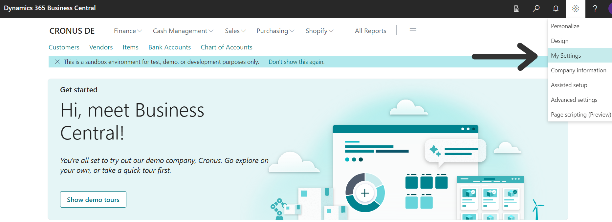
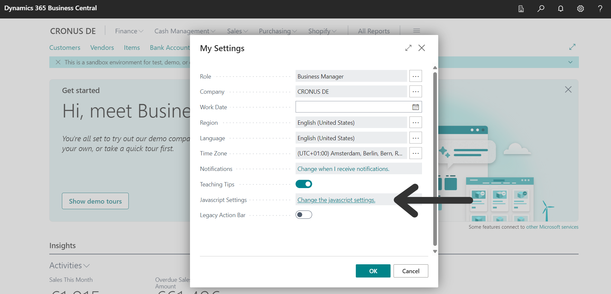
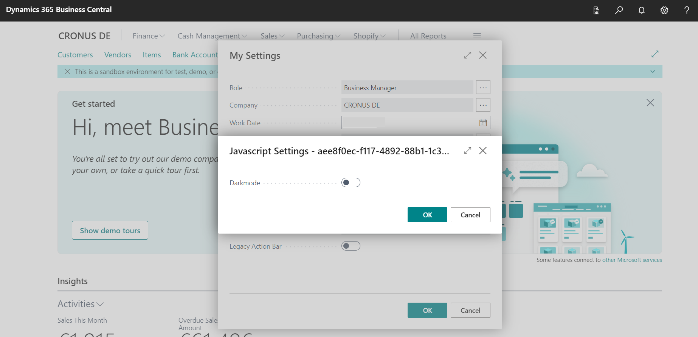
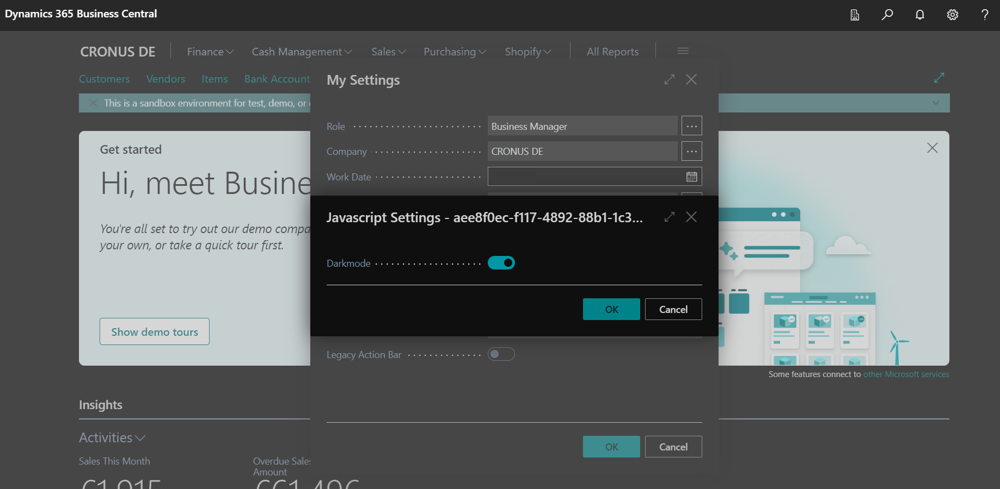
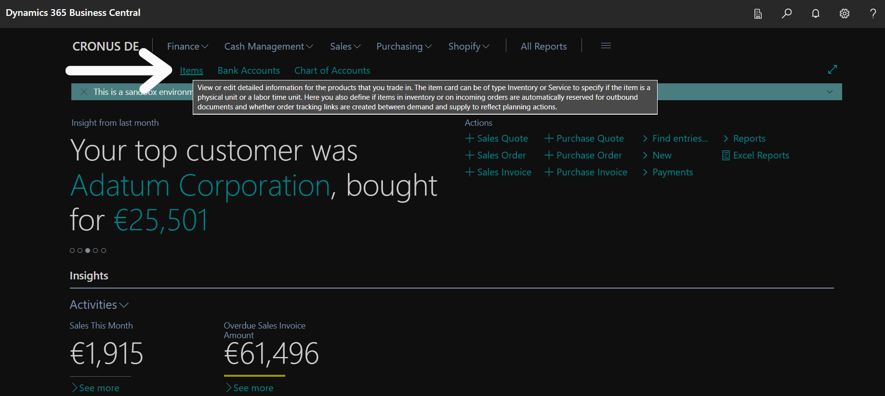
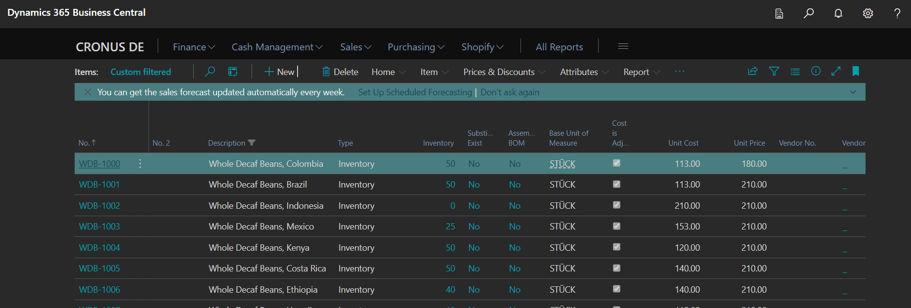

Inspired by the resident control extension of [vjekob](https://github.com/vjekob/resident-control) I wanted to create a small extension to enable darkmode in business central. For that it is necessary to have the javascript (or at least the css files) available on every page. So, in this extension the javascript plants itself into the main DOM within the startup script.

The darkmode can be activated on the "User Settings" page.

The extension provides a link to "Javascript Settings".

By now, there is only one option: "Darkmode".

Turn it on to activate the dark theme.

At this moment, the control add-in only exists in the business manager role. It must be added to the desired role, right after the headline, within a page extension.

Then it is available globally, even when navigating through pages.

